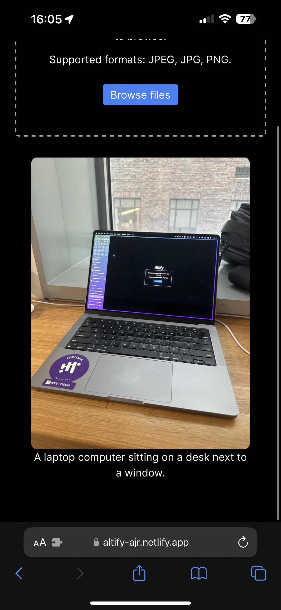
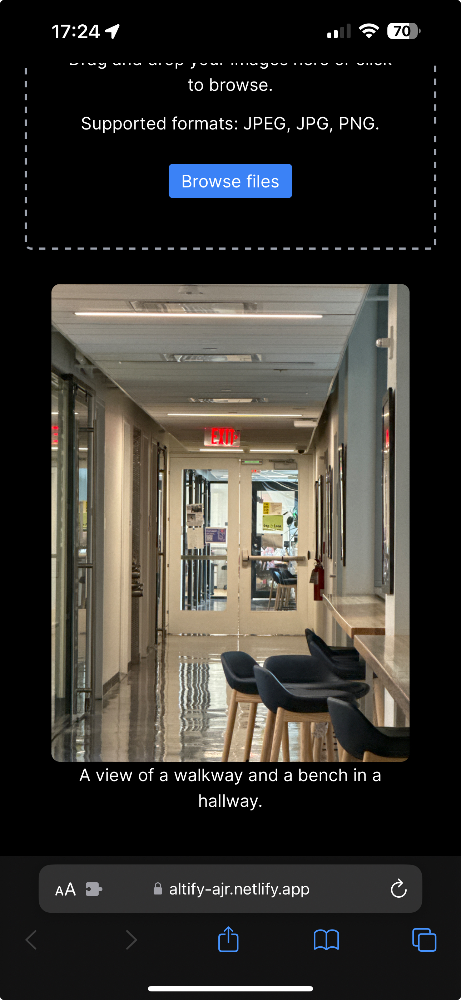
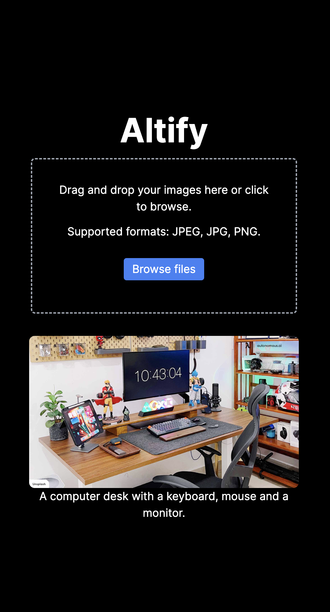

---
---

# Altify

## Links

[Repo Link](https://github.com/alanvww/altify)

https://altify-ajr.netlify.app

## Description

Altify is a Chrome extension that utilizes the power of AI to generate alt text for images on the web. The extension uses [transformers.js](https://huggingface.co/docs/transformers.js/index) to generate alt text for images on the website the user is currently visiting and aims to generate alt text for images that have no alt text or alt text that is not descriptive enough, which is a common problem for many websites. The goal of this project is to help make the web more accessible to people with visual impairments, lowering the barrier for them to access the web and improving the overall user experience for everyone.

## Tech Stack

Next.js

TailwindCSS

Transformers.js

Model - [distilvit](https://huggingface.co/tarekziade/distilvit) or [distilvit by Mozilla](https://huggingface.co/Mozilla/distilvit)

## References

[transformers.js](https://huggingface.co/docs/transformers.js/index)

[p5.js](https://p5js.org/)

[Chrome Extension](https://developer.chrome.com/docs/extensions/mv3/getstarted/)

[Chrome Extension - Content Scripts](https://developer.chrome.com/docs/extensions/mv3/content_scripts/)

[image-to-text](https://huggingface.co/docs/transformers.js/api/pipelines#module_pipelines.ImageToTextPipeline)

[Image Accessibility Creator](https://asuo-images.streamlit.app/)

[AI Alt Text Generator](https://alttext.ai/)

## Demo & Screenshots

<iframe width="560" height="315" src="https://www.youtube.com/embed/tjDAxrLKOwo?si=CqBvwTreK68ix-0y" title="YouTube video player" frameborder="0" allow="accelerometer; autoplay; clipboard-write; encrypted-media; gyroscope; picture-in-picture; web-share" referrerpolicy="strict-origin-when-cross-origin" allowfullscreen></iframe>

