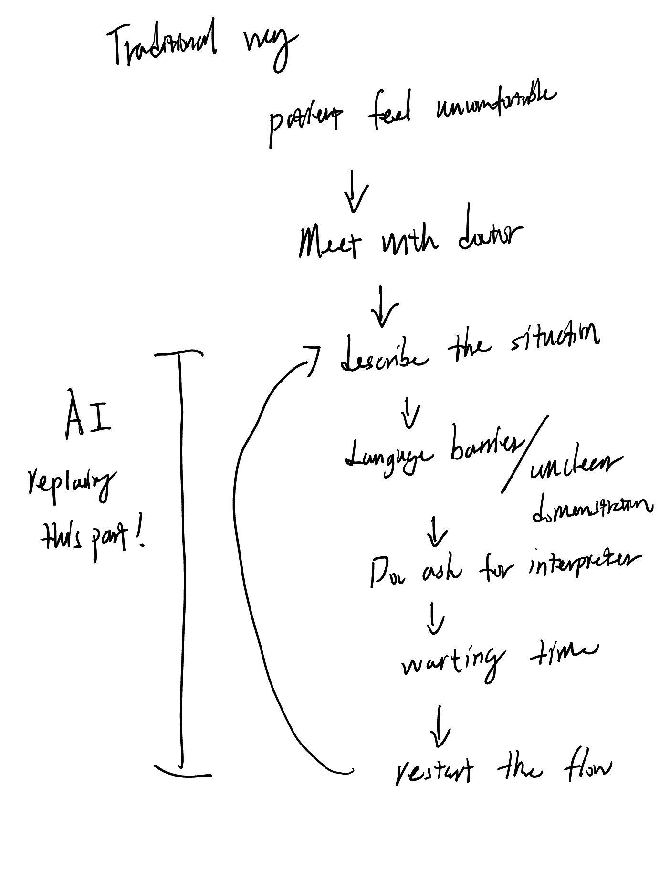

---
---

# Blog Post - "A people's guide to AI"

## When you hear the words “Artificial Intelligence”, what are the first four things that come to your mind?

1. Things in sci-fi movies: Skynet, Terminator, The Matrix… crazy super computers want to invade the human world.
2. “Super computers” in reality like AlphaGO (it's actually a program), or something related to supercomputing, something with ultra performances.
3. Algorithm and its applications: Search engines, social media recommendation, ChatGPT, text-to-image……
4. enhancing/replacing human in different workflows.

## Think about the devices and/or digital services you use daily. Write below a list of the top three that are present in your life.

1. Email and team collaboration apps(Canary and Google Chat)
2. Search engine(duckduckgo and perplexity)
3. Youtube

For the top 2 services, I actively use their AI features so there is no such thing as a "surprise" moment. But for Youtube, the algorithm is always trying to guess what I want to watch instead of just going with the channels that I have subscribed to. At some point, it's so easy to see that my experience is being tailored.

| DEVICE OR DIGITAL SERVICE WITH AI                          | AI FUNCTION(S)                                                             |
| :--------------------------------------------------------- | :------------------------------------------------------------------------- |
| Email inbox                                                | spam filter                                                                |
| Check depositing                                           | virtual assistant, recommendation engines.                                 |
| Texting and mobile keyboards                               | handwriting recognition, auto completion, machine translation(transcribe?) |
| Netflix                                                    | recommendation engines                                                     |
| Google (search function)                                   | recommendation engines, auto completion                                    |
| Social media platforms (Instagram, Facebook, Twitter, etc) | recommendation engines, conversatonal systems                              |
| Automated message systems                                  | conversational systems, virtual assistant(bad)                             |

## Gain

Having AI capabilities in our daily lives somehow helps us interact with these devices and services in a more natural way. For some workflows, these capabilities could actually make people's jobs easier and save them time.

## Lose

Privacy, the user data is collected by these tech companies. And because the algorithms are designed to make us stay on the same platform longer, they would show us the content we like, which makes people's minds more one-sided.

| WHAT PROBLEM ARE YOU TRYING TO ADDRESS ?                                                           | For non-native English speakers, it can be difficult to describe their condition, such as pain level, at a doctor's appointment.                                                                              |
| :------------------------------------------------------------------------------------------------- | :------------------------------------------------------------------------------------------------------------------------------------------------------------------------------------------------------------ |
| HOW CAN AI HELP SOLVE THIS ISSUE?                                                                  | I would like to have an AI assistant to bridge the gap between doctor and patient.                                                                                                                            |
| WHAT ROLE WILL HUMANS HAVE IN ADDRESSING THIS ISSUE?                                               | In this problem, one of the two human parties needs help and the other wants to provide it. Having AI on board will make the process easier and allow both parties to achieve their goals faster.             |
| WHAT DATA DO YOU NEED TO CREATE AN AI TO HELP YOU ADDRESS YOUR ISSUE?                              | basic medical knowledge, and verbalized descriptions of conditions under different languages.                                                                                                                 |
| HOW WILL YOU RESPONSIBLY GATHER THIS DATA IN A WAY THAT RESPECTS INDIVIDUALS’ PRIVACY AND CONSENT? | I think the best way to do this is to have a good enough model and then only use it with the patient's consent. Delete the data after use and do not upload the results, leaving the backups with the clinic. |

