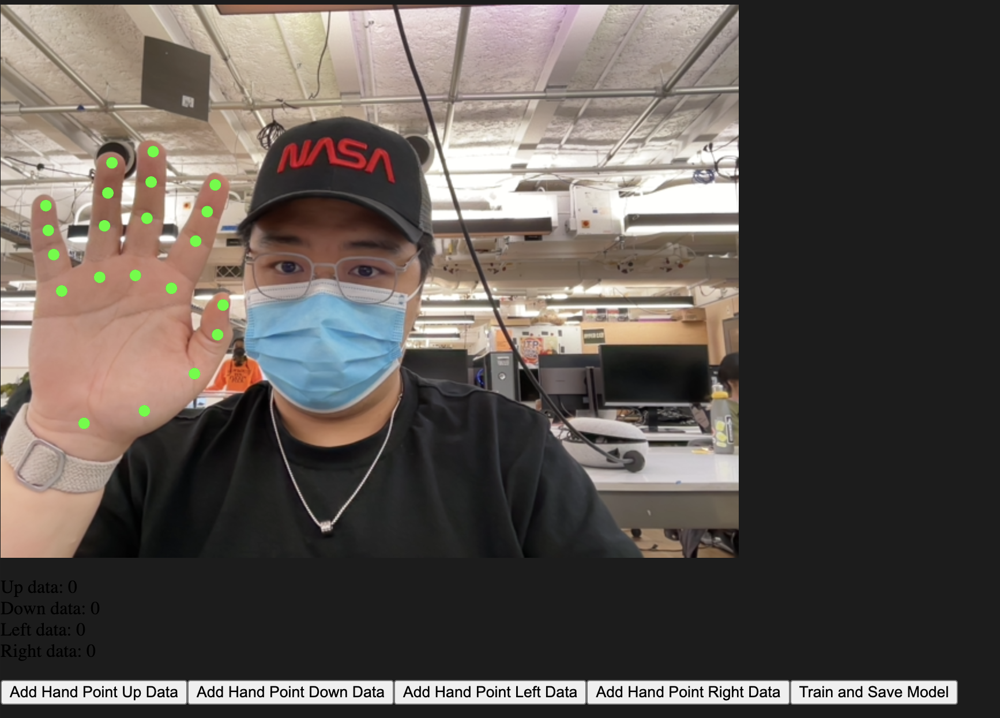
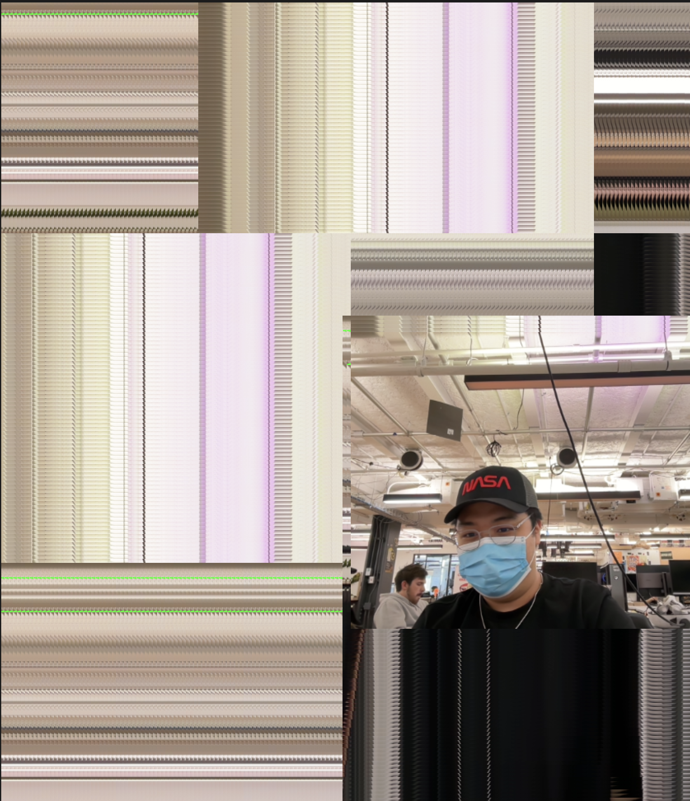

---
---

# Neural Network HandPose Train & Interactive Webcam Controller

## Introduction

In this project, I've developed a fascinating application that combines machine learning with real-time interaction, allowing users to control the webcam display on a canvas using hand gestures. This is achieved through the integration of p5.js for the visual aspects and ml5.js for the machine learning component, specifically using the handPose model for gesture recognition.

## The Concept

The core idea is to create an interface that responds to physical movements, making the digital experience more interactive and intuitive. By training a neural network to recognize hand gestures, we enable a unique way of interacting with web applications.

## Project Overview

### Training the Neural Network

#### Preview

#### [Sketch](https://editor.p5js.org/alanvww/sketches/rCBCQ1RzG)

<iframe src="https://editor.p5js.org/alanvww/full/rCBCQ1RzG"></iframe>

The first part of the project involves training a neural network to understand four basic hand gestures: Up, Down, Left, and Right. This is done through the following steps:

1. **HandPose Model Initialization**: We start by loading the `handPose` model using `ml5.handPose()`, which provides the keypoints of a detected hand in real-time.
2. **Data Collection**: With the webcam activated, the user can perform gestures, and the corresponding hand keypoints data are collected by pressing buttons assigned to each direction.
3. **Training**: After collecting enough data for each gesture, the neural network is trained using this data.
4. **Model Saving**: The trained model is then saved for future use in controlling the webcam display.

### Controlling the Webcam Display

#### Preview

#### [Sketch](https://editor.p5js.org/alanvww/sketches/0dsOrHpiO)

<iframe src="https://editor.p5js.org/alanvww/full/0dsOrHpiO"></iframe>

In the second part, the trained model is used to control the position of the webcam display on the canvas:

1. **Loading the Trained Model**: The saved model from the previous step is loaded.
2. **Real-time Gesture Recognition**: The handPose model detects the hand’s position and gestures, and the pre-trained classifier predicts the gesture.
3. **Movement Control**: Based on the recognized gesture, the webcam display moves accordingly on the canvas.

## Challenges and Learnings

The main challenges encountered in this project included accurate gesture recognition and ensuring smooth real-time interaction. Through this project, I learned a lot about machine learning implementation in web environments, real-time data processing, and interactive UI design using p5.js.

## Conclusion

Integrating machine learning with interactive web technologies like p5.js and ml5.js opens up a plethora of possibilities for creative applications. This project not only showcases the power of combining these technologies but also serves as a foundation for more advanced gesture-based interaction systems in the future.
