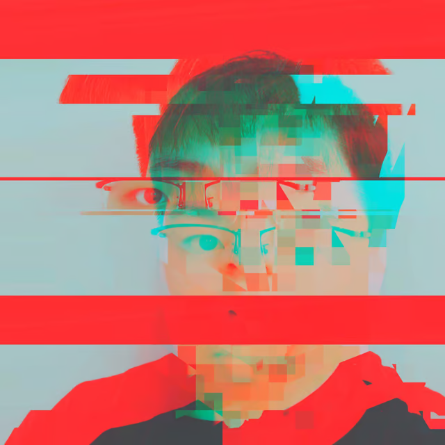
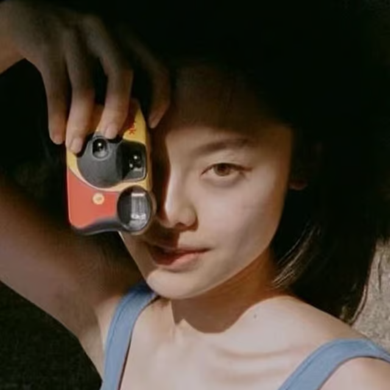
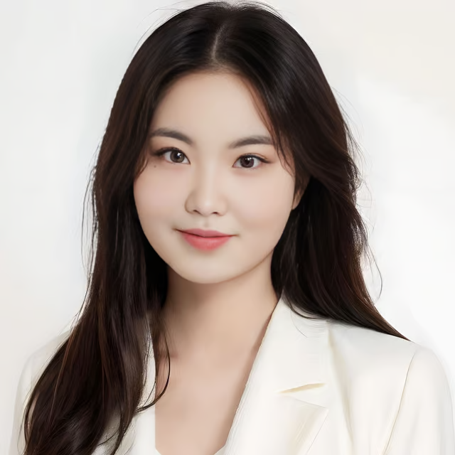

---
tags:
  - PComp

next: { text: 'index', link: './index' }
---

# Gestura

## Project Description

Gestura is a wearable device that revolutionizes the performing arts by empowering artists with cerebral palsy and limited speech abilities. Gestura represents a transformative approach to stage performance and real-time expression, transcending traditional boundaries of communication. It redefines the intersection of technology and art, extending its reach to artists across disciplines. As a gesture-based system, Gestura enables performers to manipulate the nuances of sounds and visuals through the simple movement of their fingers or arms. This innovative technology not only expands the realm of possibility for those with speech limitations but also offers a new dimension of expression for the artistically adventurous. Each movement becomes a brush stroke in a stage canvas, allowing the seamless integration of sound and visuals with physical expression. Gestura's user-centric design is the cornerstone of its inclusivity, inviting individuals to customize its functions to their unique expressive body language. It is a testament to the power of adaptive technology to not just overcome barriers but to create an entirely new lexicon of artistic vocabulary. With Gestura, the body speaks in tones, and movement resonates with the voice of creativity.

## Team Members

<table>
<tr>

</tr>
<tr>
<td>

### Alan Ren

- Creative Technologist, Frontend Developer
- Contribution: Physical computing & Wearable Engineering
- [alan.ren@nyu.edu](mailto:alan.ren@nyu.edu) / ins: [@alan.j.ren](https://www.instagram.com/alan.j.ren/)
- [alan.ooo](https://alan.ooo)

</td>
<td>

### Hanyong(Kyrie) Yang

- UX Designer with Fashion Design & Management Background
- Contribution: Product Design & Branding, Wearable Engineering
- [hy1698@nyu.edu](mailto:hy1698@nyu.edu) / ins: [@kyriey.ooo](https://www.instagram.com/kyriey.ooo)

</td>

</tr>
<tr>
<td>

### Kefan Lyu

- Industrial Designer
- Contribution: Sound Output with Max MSP & Video Editing
- [kl5009@nyu.edu](mailto:kl5009@nyu.edu) \ ins: [@klyu_design](https://www.instagram.com/klyu_design/)
</td>
<td>

### Muqing Wang

- Product Designer
- Contribution: Visual Output, Project Outreach
- [mw5318@nyu.edu](mailto:mw5318@nyu.edu) / [LinkedIn](https://www.linkedin.com/in/murphy-muqing-wang-089760162)

</td>
</tr>
</table>

## Video Demo

<iframe width="560" height="315" src="https://www.youtube.com/embed/gKcay8ixbps?si=9It1mbb0w2NoilUY" title="YouTube video player" frameborder="0" allow="accelerometer; autoplay; clipboard-write; encrypted-media; gyroscope; picture-in-picture; web-share" allowfullscreen></iframe>

## Technical Details

- Hand-made leather glove and arm strap that fits most people.
- Arduino Nano 33 IoT
  - Flex Sensors
  - Soft Potentiometer
  - Accelerometer
  - Gyroscope
  - Wifi
  - 9V Battery
- TouchDesigner - Visual
- Max/MSP/Jitte - Audio
